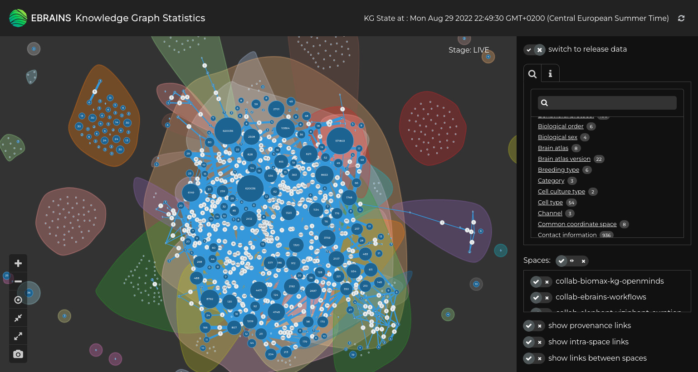

# KG Statistics

*Visualize the current state of the EBRAINS Knowledge Graph with KG Statistics*

### Visualize the current Knowledge Graph
One picture says more than 1000 words - this is especially true if you try to keep the overview of what metadata 
is in your Knowledge Graph. We therefore have built visualizations to see different aspects of the Knowledge Graph 
- such as the existing data structures (and their number of occurrences) their connections as well as which and how 
- many properties they contain (e.g. to figure out if there are instances not following the conventions).
